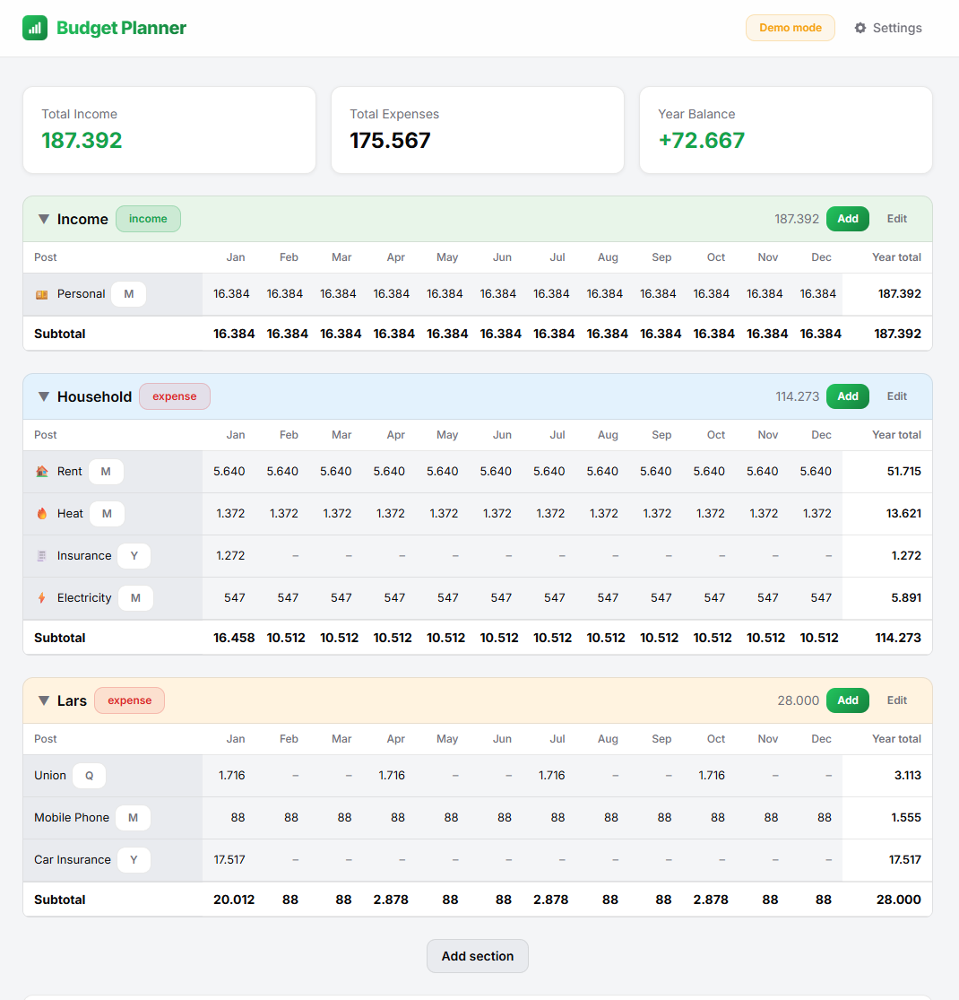

# Budget Planner

A self-hosted annual budget planner. Track income and expenses across custom sections with monthly breakdowns, running balances, and cumulative totals.



## Getting started

Pick whichever install path matches your setup. All paths land on [http://localhost:3000](http://localhost:3000). Data is persisted to `budget.json` (in the Docker volume or `./data/` for local installs).

### 1. Docker (Docker Desktop, NAS, or any Docker server)

Works on Synology, Unraid, TrueNAS, QNAP, Proxmox, or a plain Docker host.

```bash
docker run -d \
  --name budget-planner \
  -p 3000:3000 \
  -v budget-planner-data:/app/data \
  --restart unless-stopped \
  larsmikki/budget-planner:latest
```

Or with Compose:

```yaml
services:
  budget-planner:
    image: larsmikki/budget-planner:latest
    container_name: budget-planner
    ports:
      - "3000:3000"
    volumes:
      - budget-planner-data:/app/data
    restart: unless-stopped

volumes:
  budget-planner-data:
```

To build the image locally instead: `docker build -t budget-planner . && docker run -p 3000:3000 -v budget-planner-data:/app/data budget-planner`.

> **Upgrading from Budgety?** This app was previously published as `larsmikki/budgety`. The image, container, and volume names have changed. Your budget lives in the old `budgety-data` volume — either keep `budgety-data` as the volume name in your compose file, or copy its contents into `budget-planner-data` before switching. Your saved theme preference resets once.

### 2. Local install on Windows

Requires [Git for Windows](https://git-scm.com/download/win) and [Node.js 20+](https://nodejs.org/).

```powershell
git clone https://github.com/larsmikki/budget-planner.git
cd budget-planner
npm install
npm run dev
```

For a production build: `npm run build && npm start`.

### 3. Local install on macOS

```bash
brew install node git
git clone https://github.com/larsmikki/budget-planner.git
cd budget-planner
npm install
npm run dev
```

For a production build: `npm run build && npm start`.

### 4. Local install on Linux

Debian/Ubuntu:

```bash
curl -fsSL https://deb.nodesource.com/setup_20.x | sudo -E bash -
sudo apt-get install -y nodejs git

git clone https://github.com/larsmikki/budget-planner.git
cd budget-planner
npm install
npm run dev
```

On Fedora/RHEL use `dnf install nodejs git`; on Arch use `pacman -S nodejs npm git`.

For a production build: `npm run build && npm start`.

## Features

- **Annual budget grid** — 12-month view with per-post and per-section subtotals
- **Custom sections** — organize posts into income/expense groups with optional color coding
- **Flexible frequencies** — monthly, quarterly, biannual, yearly, or custom month selection
- **Inline editing** — double-click any cell to override amounts directly
- **Drag and drop** — reorder posts within sections
- **Quick Setup** — pre-built templates for common budget posts
- **Themes** — light/dark and color themes
- **Multi-currency** — USD, EUR, GBP, NOK, SEK, DKK, JPY, CHF, PLN with locale-aware formatting
- **Import/Export** — JSON backup and restore
- **Demo mode** — fictive amounts for screenshots without exposing real data

## Tech stack

Monorepo with npm workspaces:

- **`client/`** — React 19 + Vite 8 + Tailwind CSS 4 + TypeScript SPA
- **`server/`** — Express + TypeScript REST API (`GET`/`PUT /api/state`), persisting to a flat `data/budget.json` — no database
- **Dev** — Vite dev server on port 3000 with `/api` proxied to the server on 3001 (`npm run dev` starts both)
- **Production** — single Express server on port 3000 serving the built client and the API (`npm run build && npm start`, or the Docker image)
- **Tests** — Vitest for client and server (`npm test`)
